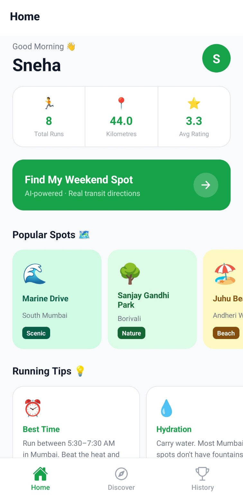
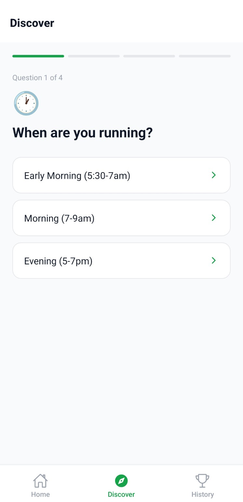
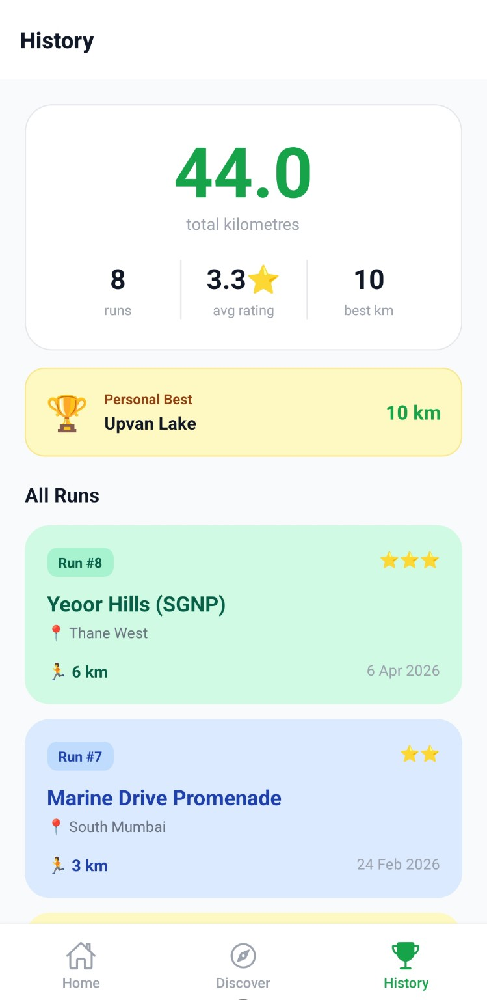

# RunSpot 🏃

> I ran out of new places to run. So I built this.

Mumbai at 5:30 AM is a different city — quiet, peaceful, almost unreal.
But beyond the famous spots, you don't really know where to go.
So instead of overthinking it, I built a small app that finds me a new running spot every weekend.

That tiny thing changed everything.

---

## What it does
- Asks 4 quick questions about your vibe, distance, and time
- Uses AI (Gemini) + real weekend weather to suggest the perfect spot
- Gives exact step-by-step public transit directions to get there
- Logs every run like a journal — distance, rating, location
- Tracks your total KMs and stats over time

## Built with
- React Native (Expo)
- Supabase (database)
- Google Maps + Directions API
- Gemini 2.5 Flash AI
- Open-Meteo (free weather API)

## Screenshots

## Setup
1. Clone this repo
2. Run `npm install`
3. Copy `.env.example` to `.env` and fill in your API keys
4. Run `npx expo start`
5. Scan QR with Expo Go on Android

## API Keys needed
- Supabase project URL and anon key → supabase.com
- Google Maps API key (Maps SDK, Places, Directions) → console.cloud.google.com
- Gemini API key → aistudio.google.com